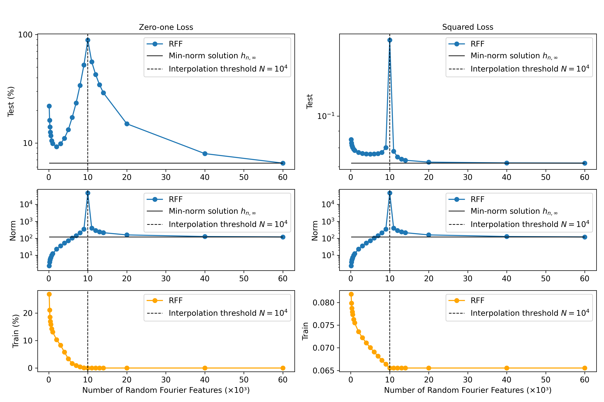

# Reconciling Modern Machine Learning Practice and the Bias-variance Trade-off Reproducibility Challenge 🚀

This repository contains the code and resources for the reproducibility challenge "Modern Machine Learning Practice and the Bias-variance Trade-off" by Jianan Xu.

## Introduction

The paper "Reconciling modern machine learning practice and the bias-variance trade-off" by Belkin et al. challenges the classical understanding of the bias-variance trade-off in machine learning. The authors present a "double descent" risk curve that extends beyond the traditional U-shaped curve, showing how increasing model capacity past the point of interpolation can lead to improved performance. This project aims to reproduce the key findings of the paper, focusing on the double descent curves for Random Fourier Features (RFF) and Fully Connected Neural Networks (FCNN) on the MNIST dataset.

## Dataset
The dataset used in this experiment is the MNIST handwritten digit dataset. The dataset contains $60,000$ training images and $10,000$ test images of handwritten digits ($0-9$). The images are grayscale, with a size of $28 \times 28$ pixels.

## Requirements
* Anaconda/Miniconda
* Python 3.10
* PyTorch 2.0.1
* NumPy
* Scikit-learn
* Omegaconf
* Wandb (optional for logging)

## Dependencies
This project uses a `conda` environment to manage all dependencies. Under the root directory of the project repository, run the following command to create the environment from the `environment.yaml` file:
```
conda env create -f environment.yaml -n double_descent
```
Activate the environment:
```
conda activate double_descent
```

## Usage
1. Prepare the dataset:

[Download the MNIST dataset](http://yann.lecun.com/exdb/mnist/), unzip and place the four files under:
```
data
└── MNIST
    └── raw
        ├── t10k-images.idx3-ubyte
        ├── t10k-labels.idx1-ubyte
        ├── train-images.idx3-ubyte
        └── train-labels.idx1-ubyte
```

2. Configure the model and training parameters:
   
The configurations for the experiments are stored in YAML files under `config`. The default configuration files are `rff_mnist.yaml` for RFF models and `fcnn_mnist.yaml` for FCNNs. You can create a new configuration file or modify the existing one to customize the experiment parameters.

3. Run the experiment:
   
To run the experiment, use the following command:
```
python run.py --model_type <model_type> --config <configuration_file>
```
Replace <model_type> with either `rff` or `fcnn` to select the model you want to use. Replace <configuration_file> with either `rff_mnist` or `fcnn_mnist` accordingly.

> [!NOTE]
> Before running the experiments, make sure the <code>results/</code> folder is empty. This ensures that the new results are saved properly without conflicts from previous runs. If needed, manually delete old experiment results or move them to a backup location.

4. Customize and extend Model Architectures:

The project includes two model architectures: FCNN and RFF. You can modify the existing models by updating the corresponding files (`fcnn.py`/`fcnn_wrapper.py` and `rff.py`) under `src/models/`. You can also create new ones under `src/models/`.

## Results
Our experiments successfully replicate the key findings from Figures 2 and 4 in Belkin et al. For the RFF model trained on a subset of MNIST ($n=10,000$), we observe the double descent risk curve as the number of random features $N$ varies from $100$ to $60,000$. The test risk exhibits a classical U-shaped bias-variance trade-off curve at low $N$, with the interpolation peak occurring at $N=n$. As $N$ increases beyond the interpolation threshold, the test risk undergoes a pronounced "second descent."



For FCNNs with a single hidden layer trained on MNIST ($n=4,000$), we reproduce the double descent behavior as the number of hidden units $H$ increases. The interpolation threshold occurs at $40,000$ total parameters (when H ≈ 4,000). As with RFF, the test risk decreases when increasing model capacity past interpolation.


These results confirm the existence of the double descent curve and highlight the need to rethink traditional notions of model selection and generalization.

## Project Structure
The project has the following structure:
```
├── config/                 # Configuration files for experiments
├── data/                   # Dataset storage
├── results/                # Experiment results and logs
├── src/                    # Source code
│   ├── data/               # Data loading and preprocessing
│   ├── eval/               # Evaluation metrics and functions
│   ├── models/             # Model architectures and wrappers
│   ├── utils/              # Utility functions and constants
│   └── experiment.py       # Main experiment class
|
├── job.sh                  # Job script for running experiments
├── plot_fcnn.py            # Plotting script for FCNN results
├── plot_rff.py             # Plotting script for RFF results
├── environment.yaml        # Conda environment configuration
├── README.md               # Project documentation
└── run.py                  # Main script to run experiments
```
